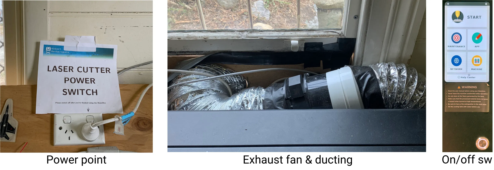

# A simple example job to show the basics of our BeamBox
Whether or not you've not used a laser cutter before, this will show you the basic setup
of our BeamBox Pro™.

## Background
For full details, go to [Laser Cutter Basics](Laser%20Cutter%20Basics), but briefly:

- The BeamBox can work on sheet material up to 597x373mm in size, 
but it's easier to keep your work pieces smaller than 580x350mm, 
because then they'll sit flat on the workbed and be fully visible with its camera.
- You'll need the app Beam Studio, installable on any Windows/MacOS/Linux machine 
and downloadable from [the manufacturer's website](https://studio.flux3dp.com). 
If you don't have a suitable machine, it's installed on the PC next to the 3D printer.
- Be aware of [basic laser cutter safety](Laser%20Cutter%20Safety).

# Tutorial
## Workfile
**You'll need something to do**

- Beam Studio works with vector and raster graphics -- vectors for lines and raster for fill and/or greyscale.
You can create designs directly in Beam Studio, but we recommend creating separately a graphics file and loading that. 

- Beam Studio can load SVG graphics files and DXF CAD files. 
We suggest you create your designs with a graphical editor such as Inkscape, or a true 2D CAD tool such as LibreCAD -- 
they are far more capable than Beam Studio.

- For this turorial, we provide [an example workfile](https://hobarthackerspace.org.au/assets/wiki-assets/lasercutter_example.svg) for you to try.
It's small enough that you can use it on something from our scraps collection - 
a random piece of acrylic or MDF, at least 90x55 mm in size and 3mm thick. 

- Download it and store it somewhere suitable on the computer that you're using.
Ignore the horrible colours - you'll see their purpose shortly.

# Starting up the Laser Cutter
Before you can use the laser cutter you need to:  

- Power it up. 
	- The power switch is on the wall to the left of the laser cutter, beside the window.
	  There is a sign above it to point it out.
	- Turn on the power point switch and check that you can hear the exhaust fan running. 
		It's behind the laser cutter, in the middle of the ductwork that runs out the window. 
- Go through the startup process 
	- Press the power switch on the laser cutter control panel (the round metal one).
	- Wait while it boots up. 
	- When the display stabilises with a safety warning message, 
		read the message and press the "Accept" button.
	- The machine is ready for use when the display shows a big **"Start"** message.

{width="500px"}
