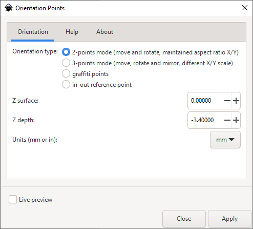
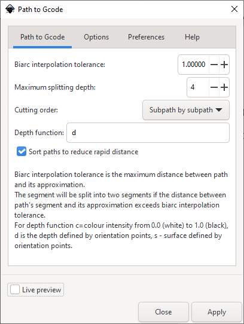
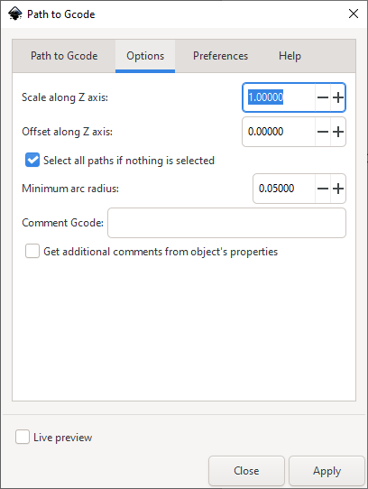
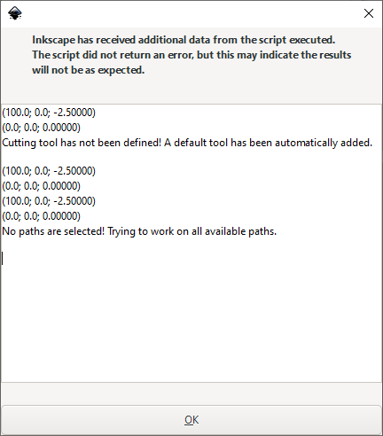
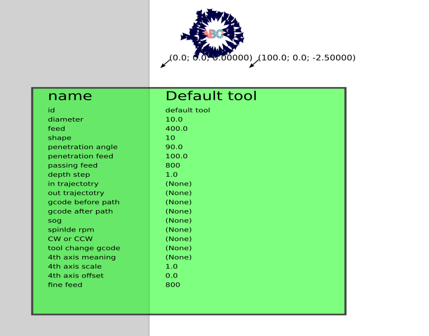
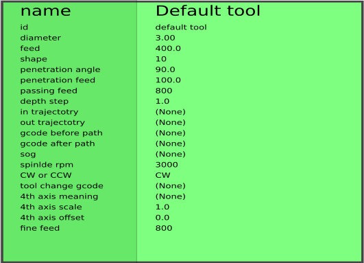

# CAD / CAM using Inkscape

CNCing is a subtractive method of creating objects, that is it removes
excess material from the base object, whereas 3D printing is an additive
method.

The initial phase is Computer-aided Design (CAD) in which the object is
designed in 2 or 3 dimensions, using tools like Inkscape, Freecad or
Tinkercad.

Computer-aided Manufacturing (CAM) is the next phase that takes the
object and converts it into specifications that can be used to direct
the CNC machine to create the object.

In this case we will use Inkscape for both CAD and CAM, and Gcode as the
target specification language for the CNC.

We will focus on 2.5D. That is, creating an object in 2D using Inkscape
in SVG format, and then adding depth later to give it the third
dimensions. Full 3D object creation is more difficult, and requires a
more complete CAD tool, such as Autocad or Freecad.

A simple example of 2.5D CAD/CAM is to cut a sign, "Exit" using Inkscape
and the CNC. The text object "Exit" is created in Inkscape (the CAD
phase), and as part of the conversion to Gcode (the CAM phase) the depth
of the cut is specified. The Gcode is then generated to achieve this cut
with the CNC.

1.	Open a document, or create a new document.
1.	Create an object, or enter text.  
	If necessary place the object precisely by using the X and Y coordinate 
	fields at the top of the window.

1.	Select the object.
	a.	Convert to Path:  
		Select `Path > Object to Path`

	a.	Add Orientation Points:  
		These tell the system where the origin point is on the object.  
		i. 	Select `Extensions > Gcodetools > Orientation Points...`  
		   	{width="4in"}  
		i. 	Leave the Orientation type as 2-points mode.
		i. 	The Z surface should normally be 0.0.
		i. 	Set the Z depth of the cut, say -2.5 mm.
		i. 	Leave the Units as mm.
		i. 	Click Apply then Close.

	a.	The Orientation Points appear as a text-like object at the bottom of the page.  
		i.	Move them up, near to other object so that the left arrow is at your origin point for the job.  
			You may want to scale the orientation text box down by dragging the bottom right arrow.
		i. 	You should then place the Orientation box precisely by using the X and Y coordinate fields at the top of window. 
			{width="6.1in"}  

 
1.  Select the object again and start the conversion to GCode:  
	a.	Select `Extensions > Gcodetools > Path to Gcode...`  
		{width="3.6in"}  
	a.	Select the `Preferences` tab:  
			{width="3.6in"}  
		i.	Set the File name of the GCode file to be generated.
		i.	Check that the Save Directory is correct.
		i.	Set the Safe Height for non-cutting movement of the CNC head. 
			This must be above the height of any part of the base material,
			clamps, bolts and any other obstructions.
		i.	Set the Units to mm.
	a.	Select the `Options` tab:  
		{width="3in"}  
		i.	Leave the Scale along Z axis as 1.0.
	a.	Select the `Path to Gcode` tab:  
		{width="3.7in"}  
		i.	Set the Depth function to the depth to be cut, -2.5mm in this case.
		i.	Click Apply and the following is displayed:  
			{width="3.7in"}  
	a.	Click OK.
	a.	Click Close on the Path to Gcode dialogue box.

1.	The current Gcode parameters are displayed in an enormous green textbox.
	Scale this down to an appropriate size.  
	The object will be broken into a number of separate paths.  
	{width="7.2in"}  
	The output GCode file will have been created, eg 'output_0001.ngc', and can be viewed with an external text editor.

1. 	Use the Inkscape text editing tool to change the Tool parameters in this green text box, set the tool diameter to 3mm and the spindle direction to CW.
	{width="5in"}

1. 	Select the object again and restart the conversion to GCode:
	a.	Select `Extensions > Gcodetools > Path to Gcode...`
	a.	Select the `Path to Gcode` tab:  
		{width="3.7in"}
	a.	Check the Depth function to the depth to be cut, -2.5mm in this case.
	a.	Click Apply to regenerate the G-Code, then OK and Close.  
		{width="7in"}

1.	It is very useful to verify the G-Code by running it on a simulator, such as [CAMotics](https://camotics.org).
