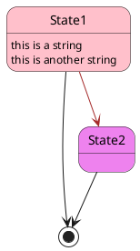
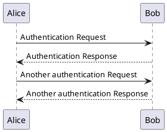

# Door system state diagram

```plantuml
@startuml
State1 #pink --> [*]
State1 : this is a string
State1 : this is another string
State1 -[#brown]-> State2 #violet
State2 --> [*]
@enduml\
```

```plantuml
@startuml
Alice -> Bob: Authentication Request
Bob --> Alice: Authentication Response
Alice -> Bob: Another authentication Request
Alice <-- Bob: Another authentication Response
@enduml\
```
