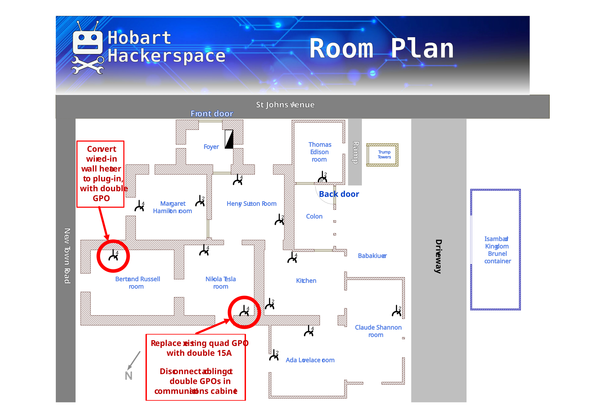

# Electrical work needed Apr 2026
For room locations see below. 
1. Heater in Bertrand Russell room
	- Switchboard circuit breaker \#2A
	- Currently a wired-in wall-mounted 2kW heater
	- Convert to plug-in and replace wall connection with GPO, so that we can add a plug-in smart switch 

2. GPO for communications equipment (Tesla Room)
	- Switchboard circuit breaker \#10B
	- Currently a quad GPO with another double GPO in parallel in Comms cabinet
	- Disconnect second double GPO
	- Replace quad GPO with 15A double GPO
		- If a 2x15A GPO is not allowable, a single would be acceptable.
3. Power supply possibilities for EV charging
	- We’d like to know what options we have for providing EV charging
	- Liaise with Glen Bertram for details.

## Room locations and GPO plan

[Printable plan](attachments/Floorplan-v08-with-wiring-changes.pdf)