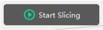
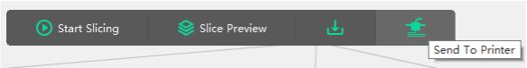
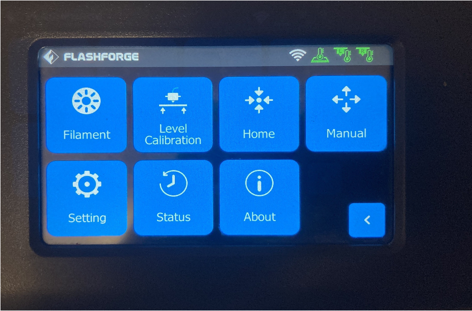
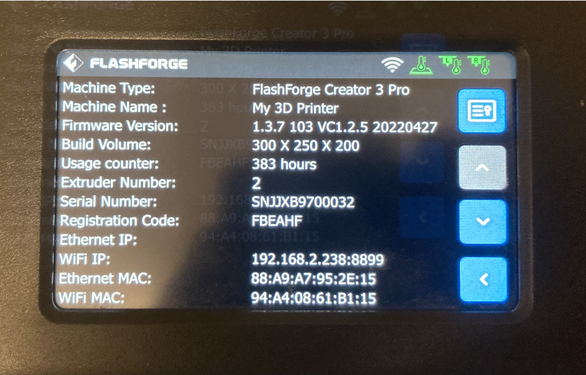

# ***FlashForge*** 3D Printing: Quick Start Guide

*Written By **Michael***

## Frequent Questions
(Answers are in the [manufacturer's *User Guide*](https://en.fss.flashforge.com/10000/software/61817cc4fa72e8e2d4654a6192d895f1.pdf).)

- *How do I load filament?*
    - Check Page **09** of the [*User Guide*](https://en.fss.flashforge.com/10000/software/61817cc4fa72e8e2d4654a6192d895f1.pdf).
- *How do Calibrate the 3D Printer?*
    - Check Page **12** Of the [*User Guide*](https://en.fss.flashforge.com/10000/software/61817cc4fa72e8e2d4654a6192d895f1.pdf).

## Contents
- [Cleaning](#cleaning-the-flashforge)
- [Preparation](#preparation)
- [Printing](#printing)
- Problem solving
	- [*FlashForge* not connecting to the application?](#flashforge-not-connecting-to-the-flashprint-application)

\newpage
# Cleaning the *FlashForge*
- There is a large spray bottle normally stored on the right side of the
*FlashForge*. It is labelled *Isopropyl Alcohol*. Twist the cap/top, this opens and adjusts the
nozzle.
- Take out the build plate from the *FlashForge* and spray two or
three times on the top of the build plate.
- Also on the right of the *FlashForge*, there is a small
clear plastic box, under the white tray. 
    - Under that there is a
microfibre cloth used to wipe down the build plate, **MAKE SURE TO
PUT IT BACK** once you have used it!

# Preparation
- To turn on the *FlashForge*, there is a rocker switch around the 3D printer's back, alongside the power cord.
- **Note**: the printer normally defaults to the left extruder, so for printing we will be using that one.
- Once you have the object or model ready, ensure the *FlashForge* has PLA or PLA plus filament installed in the left side of the printer. To do that: 
    - On the left side of the *FlashForge*, there is a rectangular cavity, that will fit most fingers. 
    - A small squeeze of the lever and light pull with your hand should remove the left panel. 
    - You might need to lift out the filament spool to see the label.
    
    {width="30%"}

# Printing
- Now open ***FlashPrint*** on the desktop computer, the icon can be found in the middle of the desktop.
- Using Explore, you can just drop and drag the file you wish to print into ***FlashPrint*** 
    or, at the top right of the ***FlashPrint*** application, 
    click on **`File`**, then **`Load file`** or the keyboard shortcut of **`CTRL/O`**.
- With the object or model loaded, you can move the object or model [if
required]{.underline}, by going to the right side of the ***FlashPrint***
application and on the second icon from the top , you\'ll see four
arrows pointing outwards icon.
    {width="10%"}
    - Clicking on that will allow you to move the object or model to where you
need it.
- Now right click on the object or model and 
    - then click on `Select all models`, 
    - then click away from the menu,
    - before right clicking on the object or model again 
    - and this time clicking on `Choose Left Extruder`.
    {width="20%"}
    - Sometimes the application might be a bit weird and this action might be
required.
- **Note**: if you have to print using the ***Right Extruder,*** you can set that here. 
    - **BUT** also be sure to change the settings in the Slicer settings!
- Make sure the print bed is clean and undamaged.
    - we have a spray bottle of isopropyl alcohol with the 3D printers for this.
- A 9-point Print Calibration might be required, please check [the manual](https://en.fss.flashforge.com/10000/software/61817cc4fa72e8e2d4654a6192d895f1.pdf).
    This is found on page 12.

- Now at the top of the ***FlashPrint*** window, you should see a button called 
`Start Slicing` click on that once. {width="10%"}

- It looks like an utter mess, but only change the details listed below.

- Please note the left side of the window, you see options going down:
    - `Printer`, 
    - `General`, 
    - `Shells`, 
    - `Infill`,
    - `\...\` 

- Below I will list things that need to be changed or checked.
    - Under Printer:
        - Left Extruder Temperature: `220°C`
        - Platform Temperature: `60°C`
        - Control Module: `Left Extruder`
    - Under InFill:
        - Fill Density: `15%` (I like to set this to `20%`)
    - Under Raft:
        - Enable Raft: `No` (`Yes` if you want to print the supporting raft)
        - Select Extruder: `Left Extruder` (Do this one anyway!)

- At the bottom right of the window click on the button called **Slice**. 
    Warning, you will need to wait a short while for the math to happen.

- Now the menu at the top would have changed!
{width="30%"}

If you want to see how your object or model will be printed click on the
button called, `Slice Preview` or you can click on the weird icon at
the far right, above you can see the pop up label `Send to Printer`.

The Printer should come alive and do its thing.
Remember **DO NOT LEAVE THE PRINTER UNATTTENDED** while it is printing!

You can pause a print from the *FlashForge* itself, using the touch screen LCD.

# Problem solving
## *FlashForge* not connecting to the ***FlashPrint*** application?

If you can't see the *FlashForge* in the application on the PC when trying
to print, it may be that the 3D Printer's IP address has changed.

To check to see if this is the cause, go to the *FlashForge* 3D printer
control panel and press on the `About` icon.

{width="50%"}

Below, we have the `About` window on the *FlashForge*.

Towards the bottom left we have `WiFi IP`: and at the time of the
photo, it is `192.168.2.238:8899`, take note that :8899 is the port
and we should not need this, only the `192.168.2.238`.

This may be different, however what is listed on the *FlashForge* when I
took the photo.

{width="50%"}

Back at the PC and within the *FlashForge* application,
connect machine window, click on `IP Address` and you should see
something like below. 

{width="50%"}

The IP address showing on the *FlashForge* is `192.168.2.238` and yet on the app 
it's `192.168.2.237`. So, if we change the 7 to 8 and then at the bottom of the window click
on `Connect Machine` you now should have access to the printer.
