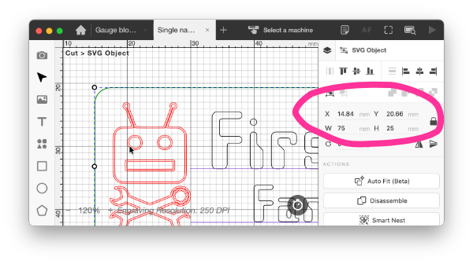

# Laser Cutter Gauge Blocks
There is no consistency in the Beambox between:

- the usable area that the laser beam can reach
- the visible area with the laser cutter's internal camera ("blind" area at top) and
- the area inside the frame of the honeycomb work platform.

(We define "top" on the work table as the edge displayed at the top of a `Beam Studio` window.)

To assist placement of the workpiece for most jobs (those smaller than the honeycomb frame), we use a couple of gauge blocks.

## Using the Gauge Blocks
The gauge blocks are sized such that, when placed inside the top of the honeycomb frame, their lower edges are just within the usable area of the cutter. This means that you can use the internal camera to verify alignment of the job on the table.

### On the laser cutter
- Place one or more gauge blocks on the honeycomb table, with their top edges against the inside of the aluminium frame.
- Place your workpiece on the honeycomb, with its left edge against the frame and its top edge against the block(s).
- If the top edge is straight, it will be parallel to the *x*-axis of the cutter.

### In Beam studio
- Select the layer in your design which shows the exact outline of the piece.
	- It can be useful to have such a layer, even if you hide it when doing the cutting/engraving. It enables easy aligning using the camera as well as repeatable location using displayed dimensions.
	- Choose the `Object` display tab in `Beam Studio`.
	- The X-Y position and will be shown
	- This also shows the width & depth, whch allows you to ensure you have any scaling right.
- The left-most edge of the workpiece will have an X dimension of just under 15mm
	- This is more precisely 14.8mm, but will vary depending on how your piece sits against the frame
- The top edge will have a Y dimension of  just under 21mm
	- Again, this is more precisely 20.7mm, but can vary slightly

## Making more Gauge Blocks
The blocks are sacrificial - it's all too easy to accidently trim the lower edge if you get the placement of the work slightly wrong. But it's easy to replace them. We make them from scrap MDF or acrylic sheet. 3-4mm is best as it usually sits level with or lower than the surface of the work.

So, grab yourself some scrap 3mm MDF, focus the laser and apply [this Beam Studio workfile](https://hobarthackerspace.sharepoint.com/:u:/s/Committee/IQBxvDCJ2k8aTZHXq4TBkzzNAcYH-HXTQVcI1tNiadKHRYw?e=k2BJdG). It will produce two blocks each 100x44.5mm in size. When you've cut them out, turn them over and etch the other side (just turn off the cut layer), so that the label will show whichever way they are put down on the bench.