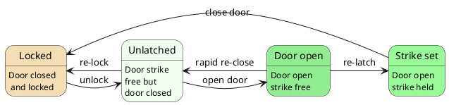
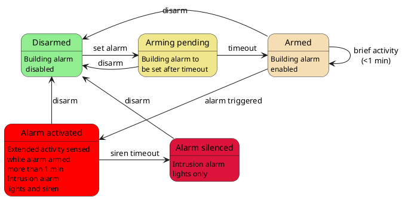
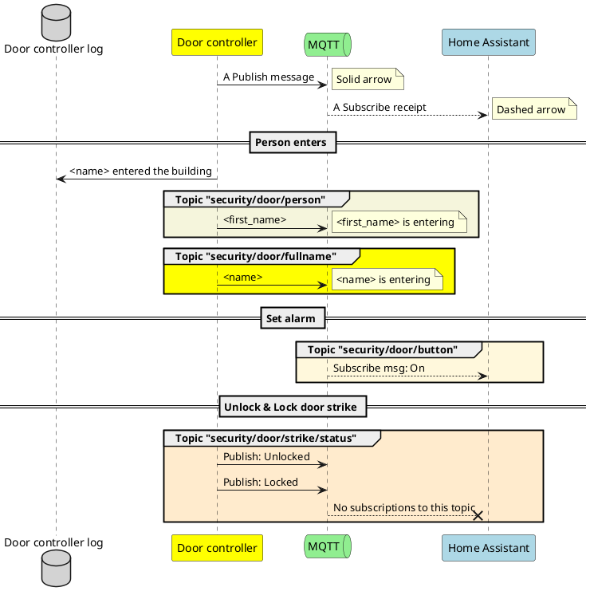

# Door system state and sequence diagrams

## State diagram
### Door

```plantuml
@startuml
state "Locked" as lk #wheat
lk : Door closed\n and locked
lk -> ul: unlock
state "Unlatched" as ul #honeydew
ul : Door strike\nfree but\ndoor closed
ul -> op: open door
ul -> lk: re-lock
state "Door open" as op #lightgreen
op : Door open\nstrike free
op -> ul: rapid re-close
op -> ls: re-latch
state "Strike set" as ls #palegreen
ls : Door open\nstrike held
ls -> lk: close door

@enduml
```

### Alarm state

```plantuml
@startuml

state "Armed" as arm #wheat
arm : Building alarm\nenabled
arm -> disarm: disarm
arm -> arm: brief activity\n(<1 min)
state "Arming pending" as ap #khaki
ap : Building alarm to\nbe set after timeout
ap -> arm: timeout
ap -> disarm: disarm
state "Disarmed" as disarm #lightgreen
disarm : Building alarm\n disabled
disarm -> ap: set alarm
state "Alarm activated" as aa #red
aa : Extended activity sensed\nwhile alarm armed\nmore than 1 min
aa : Intrusion alarm\nlights and siren
arm -down-> aa: alarm triggered
aa -> disarm: disarm
state "Alarm silenced" as sa #crimson
sa: Intrusion alarm\nlights only
aa -> sa: siren timeout
sa -up-> disarm: disarm

@enduml
```

---------------

## Messaging

```plantuml
@startuml
database "Door controller log" as log #lightgray
participant "Door controller" as dc #yellow
queue MQTT as mq #lightgreen
participant "Home Assistant" as ha #lightblue
dc -> mq : A Publish message
note right
Solid arrow
end note
mq --> ha : A Subscribe receipt
note right
Dashed arrow
end note

== Person enters ==
dc -> log: <name> entered the building

group #beige  Topic "security/door/person"
dc -> mq: <first_name>
note right
<first_name> is entering
end note
end

group #yellow  Topic "security/door/fullname"
dc -> mq: <name>
note right
<name> is entering
end note

end 
== Set alarm ==
group #cornsilk  Topic "security/door/button"

mq --> ha: Subscribe msg: On
end


== Unlock & Lock door strike == 
group #blanchedalmond  Topic "security/door/strike/status" 

dc -> mq: Publish: Unlocked
dc -> mq: Publish: Locked
mq -->x ha: No subscriptions to this topic

end
@enduml\
```
