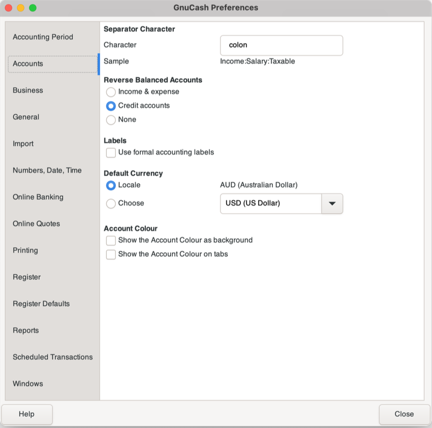
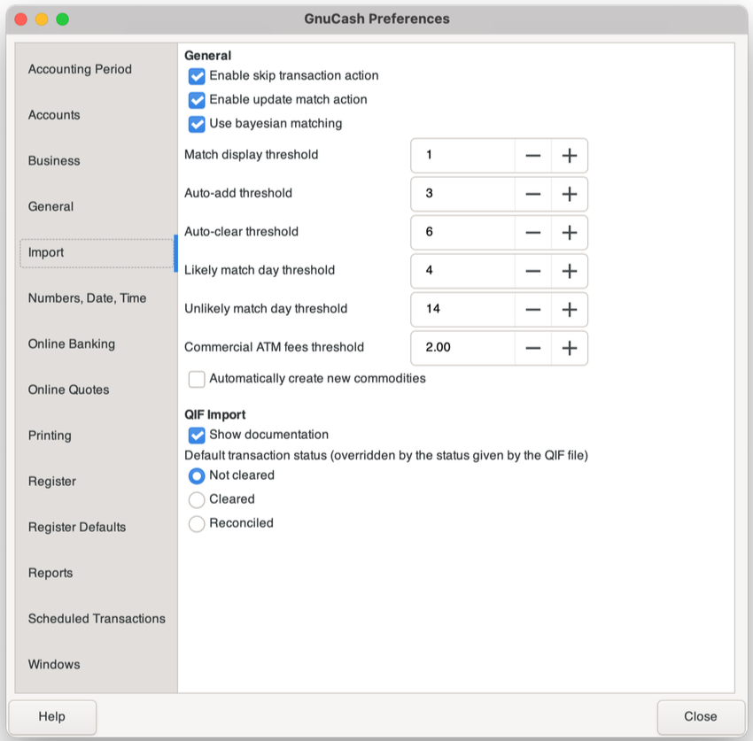
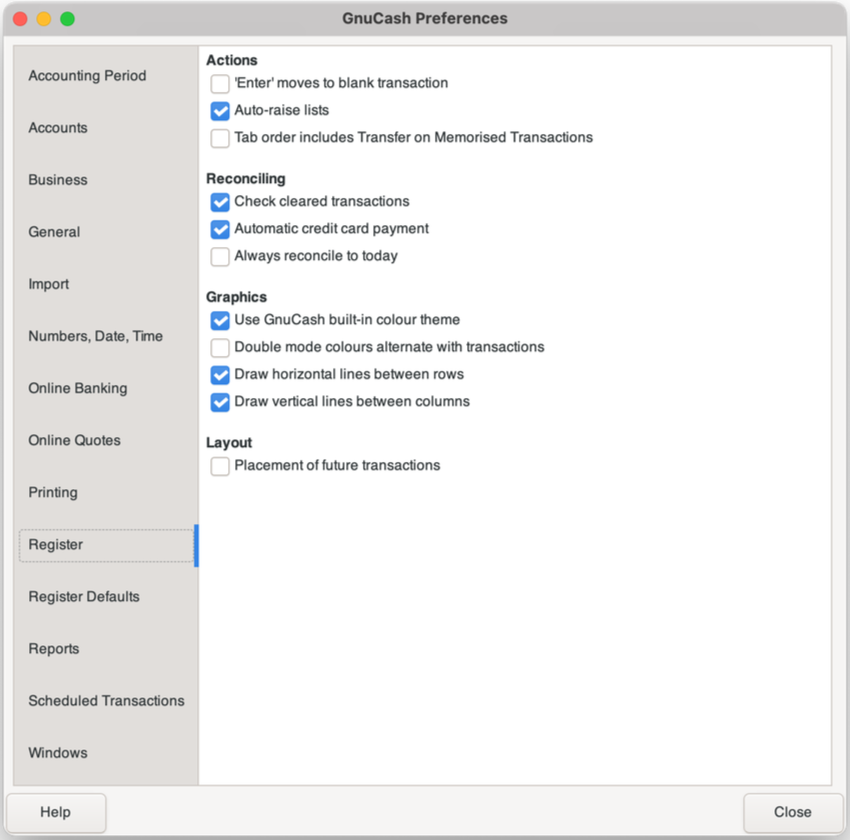
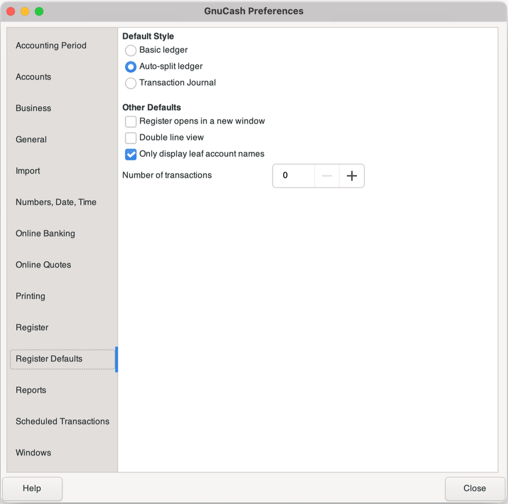

# HHS GnuCash Notes

## Introduction

We use an accounting package to avoid the many pitfalls of simple spreadsheet accounting. 
It provides a structure within which we can work, keep long-term records and get reports 
suitable for use by the HHS Committee and for reporting to external bodies.

For this purpose, we use the free GnuCash software (it runs on Windows, Mac, Linux, 
Android, Raspberry Pi). It seems to behave consistently across these platforms.

This document is intended to describe **how *we* use** GnuCash, not to document the detailed click-by-click actions.
It's assumed that HackerSpace users are competent to find their way round GUI systems
if given enough hints as to the context.

If you need it, there is extensive online documentation of the software at places like:

- [The GnuCash Tutorial and Concepts Guide](https://www.gnucash.org/viewdoc.phtml?rev=5&lang=C&doc=guide)
- [The GnuCash Manual](https://www.gnucash.org/viewdoc.phtml?rev=5&lang=C&doc=help)
- [The GnuCash Wiki](https://wiki.gnucash.org/wiki/FAQ)

So the intended audience is someone who finds themselves in the role of HHS Treasurer 
(and hence HHS Bookkeeper), possibly without much experience in bookkeeping or bookkeeping software. 
If you have such experience, feel free to skim most of this and just take note of the details 
of our particular installation and practice.

## Installation
GnuCash is an installed program (not a web app nor an app for pads/phones),
so it has to be installed on a desktop or laptop machine somewhere.
You may choose to install it wherever you like, provided the machine you use
can synchronise files with our OneDrive (Microsoft365) shared folders.

Installation instructions are available on the [GnuCash wiki site](https://wiki.gnucash.org/wiki/Installation). Note that for Linux & MacOS it's available via package managers such as `apt` or Homebrew.

GnuCash has many settings; [these are documented below](#appendix) as screen captures.

## GnuCash background
To avoid confusion or inadvertent errors when processing, it helps to have some understanding of 
the terminology and practices in accounting systems. [Skip this bit if you *really* know it](#files).

### Accounts
In this document, there is reference to "Accounts" and to "Bank accounts":  
 
1. The term "Bank account" refers to the accounts held by the Bank.
1. The term "Account" refers to one of the categories identified in the 
[Chart of Accounts](#chartofaccounts) and used by us to categorise our income and expenditure.)

### Debit vs Credit
GnuCash is a "double entry" system, which means that each recorded transaction has two parts
 - a "debit" and a "credit". (These are standard accounting terms, which, unfortunately have 
effectively the opposite meaning to those given to them in normal (non-accounting) usage.)  
Clear the option in `Preferences` >> `Accounts` >> `Labels` to have GnuCash use more 
comprehensible labels.

This means that each transaction shows funds being allocated *to* one or more accounts and an equal 
amount of funds being removed *from* one or more other accounts. These accounts may be real repositories
of funds (bank account, cash jar, ...) or they may simply be reporting categories in the Chart of Accounts. 
The essence is that the amount(s) *to* equal the amount(s) *from*.

### Transactions {#transactions}
As indicated above, every GnuCash transaction contains at least two double entry components. 
GnuCash calls these components "Splits".
They identify the source and destination accounts of the funds involved in the transaction. 

GnuCash doesn't normally display the full complexity of the splits comprising
each transaction when listing its transactions listings for accounts. 
It simply shows the amount coming or going to/from the listed account.  

You can open transactions to see their component splits in several ways:

1. Highlight the transaction and select `Menu bar` >> `Split`
2. Set either `Auto-Split Ledger` or `Transaction Journal` under the `Menu bar` >> `View` option .

## Chart of accounts {#chartofaccounts}

GnuCash maintains a Chart of Accounts (CoA) which is used as a basis for reporting income,
expenditure and financial assets. It's an hierarchical structure of categories and
sub-categories. There can be many layers of these. In reports, the amounts in each
sub-category are totalled in the category above it, to provide levels of detail for
reporting and understanding of our financial activities.

In addition to names, descriptions and their place in the hierarchy, accounts are
given numbers so that, within each category, they can be displayed in
reports in meaningful order rather than in some arbitrary alphabetical order. 
When you are creating new accounts, check the exported file for appropriate places 
in the number hierarchy.

The process of using these accounts is described in the 
[section on Allocating transactions to Accounts](#allocating).

GnuCash allows export of its Chart of Accounts to a .csv file. This allows a
convenient way to review the accounts structure. It helps to import this into
Excel or similar for viewing. Keep a copy of latest exported chart under a 
file title like `Chart of Accounts.xlsx` so that others can find it easily.
Recent copies of the Chart of Accounts are [here](https://hobarthackerspace.sharepoint.com/:f:/s/Committee/EjbcgA2yy6FGiVCe_1RasLIBxKAvigifYcO07rbHI1c5MA?e=pofcOY).

It's appropriate that the Chart of Accounts be reviewed
occasionally, such as at the end of each financial year to see that the reporting
matches our needs. In particular, you can remove old (fully acquitted) grants so 
that they don't clutter up the reports in later years.

### The "Accounts" model
Within the Chart of Accounts, we have "real" accounts and "reporting" accounts. 
(Not a formal term, just an explanatory one for this document.)

#### "Real" accounts

Real accounts are actual repositories of funds or liabilities.  (They can include tied credits
given by an organisation that we can only redeem from them in future.) 

A [transaction split](#transactions) showing funds moving *to* or *from* a real account 
identifies an actual deposit or withdrawal of real funds.

Real accounts sit under the following categories in the CoA:

| Category | Description | Notes |
| ----------- | ----------- | ----------- |
| Assets | Funds that we have access to to spend | Bank accounts, cash jar, etc. |
| Liabilities | Commitments to pay at some point in the future | Orders placed but not yet paid for, etc. |

Individual asset accounts identify the individual bank accounts, cash stores, etc.
Liabilities are just lumped into a single account as we have such a small number.

#### Bank accounts
The actual bank accounts (Westpac) are:

| Account label | Account no | Purpose |
| ----------- | ----------- | ----------- |
| `Bank Prim (696)` | 037-009 249696 | Primary account |
| `NDIS Income (709)` | 037-009 249709 | Where we hold income from NDIS |
| `Debit Card (717)` | 037-009 249717 | The account linked to our Debit cards |

#### "Reporting" accounts
The reporting accounts are just that: labels for the reasons we receive or spend money. Using such labels helps us to better understand where our money is coming from and what we do with it.

A [transaction split](#transactions) showing funds moving *to* or *from* a reporting account 
simply identifies a category to label that particular amount of income or expense.

Reporting accounts sit under the following categories in the CoA:

| Category | Description | Notes |
| ----------- | ----------- | ----------- |
| Income | Reasons that we receive funds | Grants, Memberships, etc |
| Expenditure | Uses to which our funds are put | Activities, Overheads, etc |

Individual income accounts identify the nature of the income and, where appropriate, the mode 
of payment (eg "Subs TidyHQ" identifies payments via that channel, as opposed to direct payments). 
This allows us to evaluate different payment modes, as they can cost us different amounts in fees.

Expenditure accounts are grouped by broad categories (Overheads, Capital, ...) and then into specific areas (eg power, internet, etc for Overheads).

We undertake some activities that entail both income and expenditure, and for which we may have 
to report or summarise the financial activity. (For example a grant or a funded event.) 
For these, it's appropriate to set up a specific pair of income and expenditure accounts. 
Then it's easy to isolate the transactions for reporting and to establish the net cost/profit. 
Choose names for these that identify both the event and, where they repeat, the year or date. 
Then it's easy, in later years, to clean out those accounts that are no longer relevant to the 
current financial year.

The reporting accounts break down to about three levels of hierarchy. This allows for a good
level of detail without making reports overly complex. 
All reports summarise account totals to the higher levels for quick review.

## Files
### Data Files {#datafiles}

GnuCash files are stored on the shared OneDrive/Sharepoint drive, in
the [`/Committee - Documents/Treasurer Files/GnuCash`](https://hobarthackerspace.sharepoint.com/:f:/s/Committee/ErL2AyOw2x1FmqdhZnuhZ7YB1ls63Y8ZsVt2iR0EZU5TXQ?e=P4C7p7) folder.

The working file is `HHS-GnuCash.gnucash`.  
The file format is the GnuCash default of compressed XML (compressed with `gzip`).
There is an option to store the data in a more conventional database (SQLite, MySQL or PostgreSQL) 
but at the moment this is what we are using.

GnuCash is set to autosave. This creates a stream of intermediate
files (suffixed with date/time & ".gnucash". It also saves `.log`
files. There seems little point in keeping intermediate or log files after a session
(presuming the program didn't crash :-), so set the `Preferences` option to retain
backup files for just a few days. This will automatically clean out old files
at the start of each session. 

There is, however, great value in keeping copies of the state of the 
working data file after each session. It's an application-specific form of backup 
and provides a form of debug/audit trail if things should go awry. 
It's particularly useful if you find, well after the event,
that there's something that you should have done differently 
(eg missed or inappropriately-assigned transaction). 
It helps identify the point at which things went wrong and provides a basis
for clearing things up.

To do this, simply duplicate the working file at the end of each session,
append the day's date and move it to the `Data file archive` folder.

If you don't have automatic synchronisation set up, please ensure that the
`GnuCash` folder is synchronised with OneDrive after you finish a session.

### Bank export files
Bank transaction files (.OFX format) are placed in the
[`Bank export files`](https://hobarthackerspace.sharepoint.com/:f:/s/Committee/EjbndnUwVaNJnk5f4wEdE14BitlI8G9yDMy59nnmQQ6Z4w?e=d3YhnT)
sub-folder of the GnuCash folder, in suitably-dated sub-folders.

### Reports
Report files (.PDF format) are placed in the 
[`Reports`](https://hobarthackerspace.sharepoint.com/:f:/s/Committee/EvSy7YUsJ3tEshMkdtlKAPUBTv0Rvg_Qr1_rhwTey52lTg?e=K3aJJL) 
sub-folder of the GnuCash folder, in suitably-dated sub-folders.

If you need to store a report in another folder (eg as a meeting agenda document), 
please keep an original in the `Reports` folder. This ensures that we have a long-term
record of reports in one place.

## Processing Bank Transactions

To provide the data for GnuCash, we export information from the Bank and import it into GnuCash.

Transactions are exported from the bank as OFX files, to minimise typing and to
preserve the details for audit/checking purposes. In particular, it keeps the
descriptions of the transactions consistent between the Bank's records and ours,
should we need to work out why our computed balance does not match the Bank's 
reported one.

While GnuCash has an automated "Online Banking" facility, this seems to be limited to some
European & American banks only, so we're currently stuck with manual export/import.

### OFX Files

The OFX (Open Financial Exchange) format is used to export data from
the Westpac accounts, and import it into GnuCash.
At one stage we used QIF files, but the GnuCash import plugin for OFX is cleaner and 
doesn't duplicate transactions if you cross over the date ranges.

### Export from Westpac's online banking
1. Before you start, ascertain from GnuCash the dates of the most recently processed transactions in
each of our bank accounts. This will inform your choice of the start date of the
transactions export in the next step.
1. On the Westpac select `Overview` >> `Exports and reports` >> `Transactions > Export` and follow your way through the prompts, including:
	1. Set the date range required. You only need to do this once for each batch of exports.
	1. Choose only one account per export (Westpac requires this for export to OFX format). You can repeat the export to produce multiple files for different accounts from the one screen.
	1. Choose OFX format. 
	1. Be consistent in choosing the date format. You may need to tell GnuCash what that is when 
you come to import the file, if it's indeterminate.
Note that the date format provided does not affect the format of the file title, 
just the format of the data.
	1. Add to each filename the last three digits of the account number
(eg `Data_export_15022023-717.ofx`) or otherwise identify the account.
	1. Place the files in the 
[`Bank export files`](https://hobarthackerspace.sharepoint.com/:f:/s/Committee/EjbndnUwVaNJnk5f4wEdE14BitlI8G9yDMy59nnmQQ6Z4w?e=d3YhnT) 
sub-folder of the GnuCash folder.
1. Before you log out, grab a "Proof of balance and transactions" report (`Overview` >> `Exports 
and reports` >> `Proof of balance and transactions > Report`). This makes it easier to verify after 
you've processed everything that you have the final balances correct. (See "[Reconciliation](#reconciliation)" below.)

### Importing transaction files
1. Use the menu to select `File` >> `Import` >> `Import OFX/QFX...`. GnuCash then opens
its pedantic "Helper/Wizard". (Pedantic because many pages don't require entry, just reading.)
1. You'll have to provide the file name you wish to import (hence the last 3 digits of the account number.)  
1. The final step is to adjust every transaction so they are reported against
the appropriate income or expenditure account within the Chart of Accounts. 
The OFX importer knows which bank account transactions relate to, 
but it's up to us to tell GnuCash which reporting account they relate to.
[See next section](#allocating).

#### Duplicate transactions
If you accidentally create a duplicate transaction, it's possible to delete it. 

Strictly, if we were to follow standard accounting principles we would leave the duplicate there 
and apply a "reverse" transaction. GnuCash will allow either.

### Allocating transactions to Accounts {#allocating}
#### Overview
The OFX import process will assign all transactions to the relevant bank account,
as described above, but
it can't know which account in the Chart of Accounts to assign the income or expenditure.

So the import process assigns all transactions to one the "Imbalance - AUD" account. 

It's then a judgement call on your part to assign transactions to the appropriate account,
although mostly it's straightforward.

#### The steps for unassigned transactions
1. Open the "Imbalance - AUD" account ID and work through all the transactions showing. 
Note also that the unassigned transactions should normally also be at the end of the date sequence.
1. For each of the transactions, show its splits and then change the account ID from 
the "imbalance" one to the appropriate one from the chart of accounts, 
ensuring that the actual purpose of each transaction (or split of a transaction) is clearly shown
(see note below).  
	- The process of showing the splits of a transaction depends on your settings, in particular, the setting `Register Defaults > Default Style`:  
		1. If you have this set to `Basic ledger`, you have to right-click on the transaction line and select `Split Transaction`.
		2. If you have it set to `Auto-split ledger` (recommended) then simply clicking the transaction line will show its splits.
		3. If you have it set to `Transaction Journal` then all transactions will have their splits shown. This takes up a lot of screen space.  
1. As you work through the list and assign a reporting account to a transaction, it will disappear from the "Imbalance - AUD" account listing, so simply do each one til none are left.  
1. When you've done the lot, it's worth reviewing the recent transactions of each of the bank accounts 
to verify that the assigned reporting account for each new transaction looks ok. 
It's easy to accidently assign the wrong one when working on the split and not notice it 
as that transaction will disappear from the list.

#### Transfers between accounts
We sometimes simply move money between bank two accounts, without it leaving (or arriving at) the bank. 
A typical example is when we "top-up" the debit card account from the main account. 

When this happens, you will get two records in the QIF files - one for the source account and 
one for the destination account.
Following QIF imports, one will show up something like a "WITHDRAWAL ONLINE" against the source account, 
and as a "DEPOSIT ONLINE" or similar in the destination account.

Note that you will have to have imported the QIF file for both accounts before both transactions will be visible.
To properly reconcile these, we need to combine their information and reduce them to a single transaction, as below:
The final result should look something like this:

The cleanest way to achieve this is:  

1. Open one of the transactions in GnuCash so that it shows the splits of the transaction (see above).
	It doesn't matter which one you start with, but for the purpose of demonstration we'll presume
	that it's the receiving account (the one into which a "deposit" is made).
1. Copy the line of text that is the bank's deposit transaction description and 
	paste it into the split that refers to the receiving bank account.
1. Type a human-readable description of the joint transaction in the description column
	 of the entire transaction.
1. Identify the second transaction (from the source account from which the "withdrawal" is made).
1. Copy the bank's description from the "withdrawal" transaction into the split of the "deposit" 
	transaction so that both the deposit and withdrawal descriptions are shown.
1. Delete the duplicate transaction so that you don't have two deposits or two withdrawals.

#### Notes on transactions

1. (**Important**) It's vital that you clearly identify the actual purpose of transactions
(or splits of transactions). Without that, the reports will be far less useful or even misleading.
	1. Often the bank account reference is sufficient 
(eg *PAYMENT BY AUTHORITY TO AURORA TAS R2573159* or *DEPOSIT STRIPE STRIPE-bA1b7u1xVjb*).
In these cases those transactions can have only one purpose (unless we change to using Stripe for more than one kind of transaction:-).
	1. But sometimes it's ambiguous
(eg *DEBIT CARD PURCHASE Core Electronics 0240582818   AUS Card No. ~078500*).
In this case no-one can tell what the expenditure was for without reference to another document 
such as the invoice.
	1. In these cases, copy the bank reference from the summary line of the transaction to the split 
which directly refers to the bank account, and change the summary line into something meaningful. 
(This keeps the Bank's original documentation with its account listing - this can be useful 
when tracing clerical errors.)
For the  above example, a suitable transaction summary could be 
*Raspberry Pi 400s for NDIS and robotics group*.
1. There are some pairs of similarly named accounts, where each pair has one member in the
"Income" accounts and one in the "Expenditure" ones. It should be obvious
which to assign to a given transaction.  

#### Reconciling transactions {#reconciliation}
Reconciliation is the process of matching transactions that have been recorded internally (ie in GnuCash) 
against monthly statements from external sources such as banks to see if there are differences in the 
records and to correct any discrepancies. 
As part of this process, we also identify that we have records that show that the recorded purpose of 
a transaction is correct (eg if we record that a transaction was for the purchase of drinks for the snacks bar,
that we have a receipt from the supplier that shows that.)

Reconciliation is made easy for us by the importation of the bank's QIF export files. 
If this is done correctly, each bank transaction will show up as a GnuCash transaction. 
But of course, we have to verify that we've not missed a transaction or recorded a transaction more than once.

A first level of reconciliation is simply to verify that the GnuCash's estimation of the balance 
of each bank account matches the bank's actual balance on any given date. The "Proof of balance and transactions" report from the bank is useful for this, but note that the balance given is at the time of day that you request the report, not the start or end of business for that day. See next paragraph.

Be aware that the sequence that GnuCash shows for transactions within a given day may vary from the 
order that they show up on the bank report, so be careful if you check balances in between
transactions that occur on the same day. 
You may have to re-sequence the transactions in GnuCash, using the normally-empty "Num" field on each transaction. (Enter numbers in this field to assure the display sequence of transactions made on the same data.)

#### Splitting transactions between accounts 

Transactions can have multiple source or destination accounts, so that part of the funds
are directed to/from one account and part to/from another, 
so long as the entire transaction set of debits & credits sums to zero (balances out). 
Note that it will show up on the bank account report as *-- Split Transaction --* 
but the individual account reports will show the details.

Examples of this would be:

1. An EFT transfer from a member of a sum in payment for both a snacks debt and 3D printing filament,

1. A purchase from Bunnings with some component being for both an item of equipment and 
some maintenance materials.

The process of splitting a transaction is simple:

1. Show the transaction splits (see above)

1. Copy the bank reference from the summary line to the bank account line as described above.

1. Change the "catch-all" account reference to a relevant account from the chart of accounts.

1. Change the amount debited/credited to that account to be the correct amount for that part of the transaction.

1. As this will unbalance the transaction, GnuCash will automatically add another split showing the difference (identified as "Imbalance").

1. Change the account reference for this difference split to a relevant one and, if there are more splits change the amount. Continue until all components of the transaction have been entered.

1. It can be useful when splitting a transaction between accounts to be aware of a GnuCash shortcut: 
You can type in the amounts in the form *1.2+34.56+78*. So when an invoice, for example, 
has a list of line item amounts, only some of which are relevant to a specific account within 
the transaction, you can enter the individual amounts without having to add them up yourself.

## Recording the cash on hand (cash jar & tin)
We can treat the contents of the cash jar & cash tin just like a bank account. (It's just not nearly as safe:-)
While we don't run a cash register to record individual amounts of cash coming in (or out), it's useful (and appropriate) 
to track how much we have before it's actually deposited into the bank.

We do this by treating it as if it is a bank account, but we have to document it manually as there's no QIF file to import.
This doesn't need to be done on a weekly basis (the amounts aren't great enough), but doing it monthly allows
us to add it into the amounts reported on a monthly basis.

This means that later, when we actually bank some of that cash, we just record it in a single transaction as a transfer between accounts.

### The steps 
The process is simple: we count up how much is in each of the cash jar and cash tin and 
subtract the amount that was on-hand last time we recorded it. 

1. Create a new split transaction, with a description something like "Cash on hand as at nnnn-nn-nn".

1. Add splits for each of:
	- Cash in the jar (against the "Cash on hand" account as a "charge")
	- Cash in the cash tin (against the "Cash on hand" account as a "charge")
	- Less previous on-hand balance (also against the "Cash on hand" account, but as "income")
	- Cash received for <period> (as income to the "Snacks cash" account)

## Non-banking transactions
While all the transactions described above involve a banking account on either the credit or debit side, 
it's possible to have transactions that occur completely outside of the banking process.
An example of this would be reimbursement from the cash jar for a purchase.

While it's not normally appropriate to do this, sometimes it happens, and it's appropriate 
to capture these, otherwise, for example we won't know how much we are recovering from the honesty shop.  

These transactions have to be entered completely manually (ie not imported from a file).
In doing this, we have to recognise that we are effectively depositing cash from the cash jar into 
the system, just as if we took the cash to the bank and made a cash deposit. 
This is because we don't currently treat the cash jar money as being "within the system" 
until it's deposited. 
(While there is a *Cash on hand* account, it currently isn't used:-)

### To see how this works, let's look at a hypothetical example.  
Suppose someone purchases from Coles some Coke ($20) and some paper towels ($5), and we then reimburse 
the purchaser $25 from the cash jar. 
If we were doing this using a bank deposit followed by a reimbursement from the bank, 
the transactions would involve depositing *into* (say) the debit card account, 
followed by a transfer *from* that account to the purchaser.  
So we create a transaction that does the same, but skips the bank accounts bit:  

1. Start by creating a new (empty) transaction. On any of the account listings there's a blank 
	transaction at the bottom of the list. We'll start in the *Snacks Cash* account listing. 
	Click in the bottom empty transaction line, and it will open a new transaction, 
	with today's date and the cursor in the *Memo* column. Enter in that line something like 
	"*Coles drinks & cleaning reimbursed from cash jar*". 
1. The deposit would have withdrawn from the (external) *Snacks Cash* account and 
	deposited into the debit card account. So the first part of our transaction 
	withdraws $25 from the *Snacks Cash* account. Enter that by clicking in the next blank line, 
	selecting the *Snacks Cash* account, entering the amount ($25)in the *Income* column and entering 
	something appropriate like "*Reimbursement to Joe Bloggs from cash jar*" in the *Memo* column. 
1. The transfer to the purchaser would have involved withdrawing funds from the bank account  
	and marking the amounts against the relevant expenditure account(s). So the second and subsequent 
	part of our example transaction would be $20 in the *Charge* column against the *Snacks Out* 
	account (for the Coke). This will immediately create an "Imbalance" line. 
	Change that to show $5 against the *Cleaning costs* account for the towels,
	and add appropriate *Memo* entries for each component. 
1. Note that, if you start the blank transaction in a different kind of account, the columns 
	will have different labels. Expense accounts will have *Tot Expense* and *Tot Rebate* 
	instead of *Charge* and *Income*, while a banking account will have *Tot Deposit* and *Tot Withdrawal*. 
	But the principles are the same -- just make sure that you get them the right way round. 
	You can check this easily: if the "receiving" account goes down afterwards, you've got it the wrong way round:-)

## Finishing up
### Quality assurance
When you've finished, there are several simple checks that help to assure you that all
is correct:  

1. There should be no remaining transactions assigned to one of the "catch-all" accounts
(DEP, CREDIT, POS, PAYMENT).
1. There should be a zero balance in both the "Imbalance" and "Orphan" accounts.
1. (**Critically**) The balance in each of the GnuCash representations of the bank
accounts at the end of one day's transactions should match the balance in the real
bank account for that particular date. 
This is a vital part of reconciliation of your GnuCash accounts with the bank accounts.
You can verify the match by pulling a "Proof of balance" report at the same time as you 
pull down the transaction (QIF) files, and then checking the individual account balances.

### Don't forget to keep a snapshot
Close GnuCash and, [as described above](#datafiles), duplicate the working file, append the day's date to its title and move it to the `Data file archive` folder.

## Reporting
### Monthly reports
Reports are provided to the Committee at the end of each month, summarising that month's activities and showing the financial position at the end of the month.

The precise details of the reports are still evolving. As this is written (March 2023), three reports are provided:  

1. Balance sheet as at end of month  
	This shows the amounts in each of our accounts (including the cash on hand in the Space). 
	This is the least detailed but most important measure as it is the actual funds that we have available.

2. Income and Expenditure for the month  
	This shows those accounts in our chart of accounts that have had activity in the month, 
	categorising them and sub-totalling them according to the account hierarchy. 

3. Income and Expenditure for the financial year  
	As for the monthly I&E, but totalled for the entire financial year.

4. Monthly expenditure transactions  
	A list of the actual transactions from the expenditure accounts within a given month. 
	This is provided to the Committee for information and ratification.

### Producing the reports  
Reports are generated from the GnuCash `Reports` >> `Saved reports` menu. You will have to bring up the chosen saved report and then adjust its settings for the particular month.

1. For the monthly Balance sheet, open the saved `Balance sheet` report.  
	That will give a balance showing as being the end of the financial year (in reality the latest transaction).  
	To customise it for the relevant month:  
	1. Open the `Options` from the top-line menu and select `General`.  
	2. Change the `Balance sheet date` to be the 1st of the current month & click OK.  
	3. Select `Print`. This will offer a choice of printers. Choose `Print to file`.   
		This will offer a choice of file name and location. 
		(Note that there is no intermediate "where do you want to put this" type of dialog - 
		it saves it without comment in the selected (or previously-used) location.)  
	4. Download the PDF of the report and store it in the reports folder 
		in preparation for distribution or addition to meeting agendas.

2. For the two I&E reports the process is similar, starting with the saved `Income & Expenditure` report, 
	with the exception that there are two dates to be set: `Start date` and `End date`.  
	
	Produce one report with the dates set to the first of the previous and this month, and one with the dates set to 1-July and the 1st of this month.

### Annual reports
The annual reporting structure is based on the monthly reports, but just using the year-to-date reports.
Consider running one which shows *all* accounts, not just those with activity. 
This makes it easier to review the CoA against our needs.

### Grants reporting
When we are acquitting grants we have to supply a report of the expenditure  of all funds 
associated with the grant, typically including any expenditure of our own funds. 
GnuCash makes this easy. 

There are saved reports from previous grants in suitable format. Simply open one and change the dates, 
accounts and title (under `Accounts` and `General` in the `Options` menu). 
Save the report config under a new title so it's available for future runs.

## Moving from one financial year to the next
Accepted practice for not-for-profits seems to be to close off the transactions at the end of a 
financial year (EOFY) and start a fresh set of transactions with the same accounts structure. 
Obviously, the bank account amounts need to match between years, otherwise you wouldn't be able to 
check with the bank's current balance to verify that all transactions have been properly [reconciled](#reconciliation).

The simplistic solution to this is to do precisely that:  
- make a copy of the GnuCash file as at the end of the financial year  
- zero out the YTD figures  
- ensure that the bank accounts have the right starting values  
- and start each year afresh. 

(See below for a clean & easy way to do this.)

This approach may have issues if you need to report on some project, grant or similar that crosses the EOFY boundary, but this can be worked around by creating reports with the same specification from each of the years' files that apply to the project and then (if need be) merging the figures.

### The EOFY process
#### Setting up the new year's file
1. Ensure that you update your production GnuCash file to include and reconcile all transactions up until EOFY. 
(Wait a few days after EOFY for the Bank accounts to record all transactions - they are sometimes a day or so behind.)  
1. Generate all appropriate EOFY reports. In particular, you'll need a Balance Sheet report showing all current assets as at EOFY.  
1. Open the production GnuCash file and select `File` >> `Export` >> `Export Accounts`. Ensuring that the "Data format" is selected as `XML` (unless you choose to use some other storage format), select a file title and location and click on `Save as`. For convenience:  
	- Save the file in the same directory as the previous production file  
	- Give it the same title, with "-NewYear" appended.  
1. This will create a GnuCash file with no transactions but with the same Chart of Accounts as the previous one.  

When you're comfortable that all worked ok, exit GnuCash and re-arrange file titles so that:  
- the previous production file is identified as "EOFY" with the appropriate year number(s) (eg `HHS-GnuCash-EOFY-2023.gnucash` for the 2022-23 year) and  
- the new file has the title of the production file (`HHS-GnuCash-Prod.gnucash` unless you're using something else.)

Now you can open the new year's file and set it up for the new financial year.

- **Opening balances**  
	- For each of the "Assets" accounts, create a deposit transaction that credits that account with the amount that was 
	in it at the end of the previous period. 
	These should all be listed in the Balance Sheet report that you saved when generating the EOFY reports.
	
	- Give each such transaction the date of the start of the financial year and the description "Transfer balance EOFY 20nn".  
	
	- Creation of the transaction will create a split with a matching amount in the "Withdrawal" column. Assign this split to the "Opening Balances" Equity account.  

- **Accounting periods**  
	- Go to `Settings` >> `Accounting Periods` and verify that the relevant periods have been adjusted:  
		- "Relative" dates should be the start and end of the "previous month"  
		- "Absolute" dates should be the actual dates of the start and end of the current financial year.  
	- Go to `Reports` >> `Saved Report Configurations` and set the start date of the 
	"Income and Expenditure for Financial year" report to be the actual date of the start of this financial year.

Note that the changed accounting periods will create inappropriate reports if those reports are run during the first month of the financial year. This is to be expected as they are set up to be run at the start of the subsequent month.

## Appendix
### GnuCash option settings
**GnuCash preferences (MacOS - Brian Marriott)**

These are screen captures of the settings I'm using (in the same order as offered by GC). I've skipped several as they relate to capabilities we don't use, like scheduled transactions and online banking.

 
 
## Revisions
| Date | Person | Details |
| --- | --- | --- |
| 15 Feb 2023 | Brian Marriott | Complete re-work and enlargement of an original MS Word document by David Morton & Brian Marriott |
| 09 Jun 2023 | Brian Marriott | Clarified & updated reporting |
| 24 Jul 2023 | Brian Marriott | Added EOFY procedures |
| 25 Jul 2023 | Brian Marriott | Added Preferences settings |
| 30 Aug 2024 | Brian Marriott | Minor adjustments to content before putting in the Wiki |
| 08 Sep 2024 | Brian Marriott | Added some links to the OneDrive directories; Finished adding the images from the non-wiki original; Still to update the bank imoprt and cash-on-hand processing to new practices |
| 06 Mar 2025 | Brian Marriott | Changed bank transaction importing to use OFX rather than QIF files |

