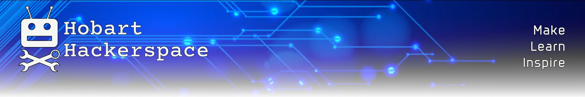

 

# Hobart Hackerspace wiki ([wiki.local](#home))

This is our documentation store. This is **your** place to stash records of how to use our gear and what projects/experiments you've done.

In the spirit of our *Make -- Learn -- Inspire* motto, use it to:

- **learn** from others' experience, 
- share how you **made** something (including the gory details *and* the mistakes) 
- **inspire** others to explore and create!

Connect from within our local network at: [wiki.local](#home) (`http` only — `https` isn’t possible in`.local` hostnames). From outside, it's [http://wiki.hobarthackerspace.org.au:7008/](http://wiki.hobarthackerspace.org.au:7008/) or 
[https://publish.obsidian.md/hhs-wiki/Hackerspace+Wiki](https://publish.obsidian.md/hhs-wiki/Hackerspace+Wiki).

You will be required log in. This is a small barrier to help retain our intellectual property. The password is the same as that for our in-house wifi connections.

We encourage all members to contribute to our wiki and correct any errors. The tool we use to maintain the site is [*Obsidian*](https://obsidian.md) — a free, multiplatform Markdown editor. [Click here for more details.](Contributing%20to%20our%20wiki.md).

# Navigation
- On larger screens there is a list of pages on the left of the screen. The search bar at the top is a full-text search.
- On small screens, the pages list and search bar will appear when you click on the “hamburger” in the top LH corner.
- On large screens there is also a “contents” display of headings in the current page on the lower right of the screen.
- You can change from light to dark theme with the sun/moon icon above the search bar.

# Safety
- [Basic rules](https://hobarthackerspace.org.au/safety/)
- [Remember our core terms of use](https://hobarthackerspace.org.au/terms_of_use/)
- If you see an issue that needs attention, please [report it to the Committee](mailto:committee@hobarthackerspace.org.au?subject=Safety%20issue&body=OH%26S%20Incident%20Report). Please use an Incident Report form, either paper or electronic. Paper forms are in the labelled box opposite the main entrance door. Electronic forms are either [PDF](https://hobarthackerspace.org.au/assets/wiki-assets/Incident_Report_Form.pdf) or [MS Word](https://hobarthackerspace.org.au/assets/wiki-assets/Incident_Report_Form.docx).

# Our Building
Our home is a shared space and [a heritage building](Gatehouses.md). Please respect these when using it.
The heritage issue means that we have to be careful how we look after the building, especially the older stone parts.

## Sharing the Space safely
[We have a set of guidelines for all those who use our Space](Sharing%20our%20Space.md)

## Leaving the building
[Here's a checklist to follow when leaving, to make sure the building is left safe & secure.](Building%20departure%20checklist.md)

# Our Equipment
- [CNC Router](CNC%20Router.md)
- [Laser Cutting](Laser%20Cutting.md)
- [3D Printing](3D_Printers.md)
- [Electronics](Electronics%20Lab.md)
- [Radio](Radio%20Station.md)

## Borrowing of equipment
Members may borrow items of the Hackerspace portable tools, but there are restrictions:

- All loans must be recorded on the loan forms above the tools drawers
- You may not borrow tools which are in heavy use or are the only examples we possess
- Tools may be borrowed for no more than two weeks, without express approval from the Committee

# Events
- [Open Night](https://hobarthackerspace.org.au/events/open-night/)
- [Projects Night](Projects%20Night.md)
- [Festival of Bright Ideas (FOBI)](Festival%20of%20Bright%20Ideas%20FOBI.md)

# Systems
- [Our website](https://hobarthackerspace.org.au)
	- [Website content & management](https://github.com/hobarthackerspace/hobarthackerspace.github.io)
	- [Public calendars](https://hobarthackerspace.org.au/events/calendar/)
		- We have calendars on our website showing event bookings and space bookings.
		- Committee members can add items to those calendars so that others can know what's happening when.
		- [Adding an event](Public%20calendars.md).
- This wiki
	- [Adding your content](Contributing%20using%20git%20on%20a%20laptop%20or%20desktop.md). The easy way to add content is to start with another page and copy its source into your new page.
	- [The wiki server and its software](The%20Wikmd%20server.md)
- Home Assistant
	- [Home assistant](https://office.hobarthackerspace.org.au:8123) gives us access to our security system - the alarms, video cameras, etc. Committee members can have access to it if they ask.
	- Details of our [Home Assistant setup & configuration](Home%20Assistant%20setup.md) are [here](Home%20Assistant%20setup.md).
- CCTV cameras
	- Most of our monitoring cameras are connected to a Hikvision NVR. Ask for permission to access that directly.
	- More recent cameras [are documented here](Video_Cameras.md).

# Administration
- These are links for Committee members access the various systems that we use to look after the Hackerspace. 
	- Committee documents are in our [OneDrive/Microsoft365 document store](Microsoft%20365%20and%20OneDrive%20file%20access.md)
	- [Management of Members' RFID tags](Members%20Door%20RFID%20Tags.md)
	- [Membership records](Membership%20records.md)
	- The [Door access controller](Door%20access%20controller.md) runs on a Rasperry Pi.
	- We use the [GnuCash accounting system](HHS%20GnuCash%20Notes.md) to manage our accounts.
		- Our books are open to all members on request. Just [ask the treasurer](mailto:treasurer@hobarthackerspace.org.au?subject=Request%20to%20look%20at%20financial%20reports&body=Please%20send%20me%20a%20link%20to%20the%20current%20financial%20reports) for access to our recent reports.
	- Networks (LAN, WAN & Internet)
		- [Internet connection](Internet%20connection%20and%20firewall.md)
		- Internal (LAN) network and WiFi
			- [Ethernet network](Ethernet_network.md)
			- [WiFi and router](WiFi%20and%20Router.md)
		- [Domain Names and DNS records](Domain%20Name%20records.md)
		- [Exposed IP ports](Internet%20connection%20and%20firewall.md##Static%20IP%20assignments%20and%20exposed%20IP%20ports)
	- Branding assets (logo, letterhead, etc etc)
		- Logo 
			- 
			- Our logo is called *Hacky* -- a friendly take on the skull & crossbones, courtesy of Shane. It's inspired, we're told, by the *Sea Shepherds'* logo. [Here's a page of usable image files.](Hacky_images.md)
		 - QR Codes
			- We're moving to set up QR codes pointing to all our equipment documentation pages. [Here's a page showing how to make one, customised for a particular page and with *Hacky* in the middle.](QR_Codes.md)
		 - Letterhead
		 	- Templates for our letterhead are available for download in both `MS Word` and `LibreOffice` formats:
				- [MS Word](attachments/Letterhead_v1.0.dotx)
				- [LibreOffice](attachments/Letterhead_v1.0.ott)
			- Please be aware that the letterhead templates are intended only for use on Hackerspace business. 
			  Any other use will be treated as the crime of fraud.
	- Building issues
		- Maintenance
			- If there are urgent major issues, contact the Health Department site manager:
				- Mike Rowley
				- ‭p: 0417 316 173‬
				- e: [michael.rowley@dhhs.tas.gov.au](mailto:michael.rowley@dhhs.tas.gov.au)
			- In an after hours emergency at Hackerspace we need to call the RHH switchboard (6166 8308) and ask for Facilities On Call
		- Electricity distribution
			- [Here is a plan of the power outlets and circuits](Power%20Distribution.md)
			- [Electrical work required 2025](Electrical%20work%202025.md)
		- [Heritage report](Gatehouses.md)

# This wiki
Our wiki is based on [*Obsidian*](https://obsidian.md) software. The content is created and maintained in *Obsidian* and then published to the web. *Obsidian* is a file-based personal note-making system, using Markdown -- a markup language you're probably already familiar with (or can learn very quickly if you're not). 

Details on how to add to or change it are in the [How to use this wiki](Contributing%20using%20git%20on%20a%20laptop%20or%20desktop.md) page. 
Briefly, all source is in [markdown](https://www.markdownguide.org) format; it is stored in and shared from a [github](https://github.com/hobart-hackerspace/wiki-obsidian) repository. [Obsidian](https://obsidian.md) is used to manage the content and to publish to this site.

The base system is maintained by [Brian Marriott](mailto:brian.marriott@hobarthackerspace.org.au) -- 
but it's up to all members to provide the content! The [details of how to do this are here](Contributing%20to%20our%20wiki.md)

If you have suggestions for improvement, 
[email Brian](mailto:brian.marriott@hobarthackerspace.org.au) or add an issue to [our  Github tickets page](https://github.com/hobart-hackerspace/wiki-obsidian/issues).

*BWM*
