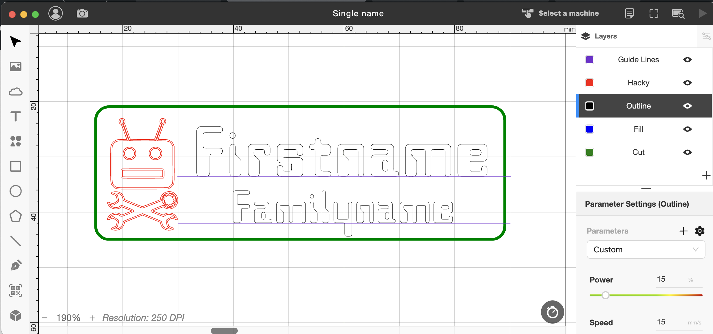

- [Making the Badges](#making-the-badges)
- [Full Details](#full-details)

# Making the badges
## Engraving individual badges
### Preliminary 

- This document presumes you have some experience with the *Beam Studio* software -- enough to cut or engrave a simple design -- and you have available the [*Beam Studio*](http://studio.flux3dp.com/#/) software (installed or web version).
- You will need a computer with the *Westminster* font files installed. [See "Lettering" below](#lettering). 
- The computer next to the Flashforge 3D printer has both the font and the software.

### Setup

Use one of the individual blank badges from the step below. Spare blanks are kept in the top drawer of the drawers in the back of the Bertram Russell room.

Place the blank badge in the cutter with its left edge against the aluminium frame of the worktable and its top edge against one of the "Blind area gauges".

Download copy of the file ["Single name.beam"](https://hobarthackerspace.sharepoint.com/:u:/s/Committee/Ebp5MX0jrB1MtPRjpT0NJtMBv8HkgwjwowR5FktcYobYAw?e=vu4gFm) to use as your working file, then start up *Beam Studio* and load the file. 
Ensure that the document resolution is set to 250dpi (`Edit` >> `Document settings`). 
Zoom in (~150-200%) to look at the object in the top LH corner. 
It should look like this:{width="30%"}

Use the camera to verify that the blank is aligned under the green outline in the image. 
If necessary, move the blank to align it. 
If you need to move the image, make sure to turn on visibility of **all** layers and select the entire image, otherwise bits will get separated. (To turn a layer visibility on or off, click the "eye" icon.)

### Adding the names

Turn off visibility of all layers except those called "Outline" and "Guide lines", then select the "Outline" layer (the layer name should get highlighted). Now select the "Firstname" text. Click it once to select the text object, then twice to place a cursor, then twice again to select all the text. 

Type in your preferred first name or nickname. It will probably end up aligned differently from the original. Re-align by dragging across so that the centre handles of the text align with the red guideline. Keep the vertical position such that the baseline of the characters is on the line.

Repeat the process with the "Familyname" text, adding your family name.

Feel free to make minor adjustments in the name placements to suit your taste, 
but we'd like you to keep the general overall layout similar to the master template, for general consistency among members. (Call it "branding" or "team consistency", but it has its purpose :smiley:)

### Name adjustments
- If there are clashes between descenders of the upper line and ascenders of the lower line, move one or both sideways to avoid the clash. Turn on both the "Cut" and "Hacky" layers to see the effect of these movements. If you need to move one or both names vertically, you may need to adjust the text size.

- In extreme cases of name length you may need to reduce the text size of one or both names -- the base sizes are 140px for the firstname and 100px for the family name (with document resolution set to 250dpi). Adjust these by selecting the text object and changing in the Object panel either its "px" size or its letter spacing ("VA"). You will then need to re-adjust the lateral position.

### Replicate outline name to fill layer
The name is repeated on two layers -- one to provide a clear letter outline (done with vector engraving) and one done with raster engraving to provide the fill.

The process to do this is simple:

1. Turn off visibility of all but the "Outline" layer.
1. Select both names and copy them without pasting anywhere. It'll sit in the paste buffer. 
1. Turn off visibility of the "Outline" layer, turn on the "Fill" layer and select it.
1. "Paste in place" the contents of the paste buffer (`Edit` >> `Paste in place`).
1. Individually select each of the firstname and family name and activate the "Infill" attribute (the little paintpot that shows up in the object attributes panel). 

You should see the text fill out to be solid instead of outline, like this: {width="350px"}

### Engraving
Verify that the setting for each of the layers are:

- Guide lines - Visibility off  
- Hacky - Visiblity off  
- Outline - Visibility on, Power 15, Speed 15, Pass count 1, Text spacing (VA) 0.05
- Fill - Visibility on, Power 15, Speed 30, Pass count 1, Fill on (paintpot) & Text spacing (VA) 0.05  
- Cut - Visibility off

Then you can run the job.

When it's done, clean off the protective film (a fiddly job:-) and apply a magnetic fastener to the back.

## Cutting blanks
We cut blanks to size with Hacky pre-engraved.
Then we just need to fill in the names on a template to cut individual badges.

The size of the base material allows for 13 blanks to be cut from one edge of the sheet, so we work from an image file that is set up to do 13 blanks in one pass.

Place the base sheet in the laser cutter with its LH edge against the aluminium frame, its top edge against the pair of "Blind area gauges" and its film covered side up.

Download a working copy of the file ["Strip_x13_blanks.beam"](https://hobarthackerspace.sharepoint.com/:u:/s/Committee/Ear3aRDmrz5OmTUihCyT6RUBzvKaqeL61rfbkviL52VETw?e=qQAadN). Start up *Beam Studio* and load the file. Verify top and bottom alignment of the panel and run the job. It takes about 11 minutes.

Leave the film on until the name has been engraved -- it may be a pain to remove but it makes for a cleaner job.

### Settings
In case you need to adjust them, the working laser settings are:

- Hacky layer - Power 15, Speed 15, Passes 2  
- Cut layer - Power 55, Speed 7, Passes 1

### Image placement on BeamBox worktable
A strip of blanks made from a larger sheet used a vertical cut specified in *Beam Studio* at 87mm. 
This ended up at 72mm in from the edge of the sheet when the sheet was hard against the edge of the aluminium frame (ie allow 15mm at least non-usable area if avoiding cutting over frame.

The top edge of an image will match the edge of a "Blind area gauge" if the image is set at 21mm down from the top of the *Beam Studio* "document".

# Full details

## Material
Badges are made of a layered acrylic material -- Rowmark Lasermax (modern-day "Traffolyte").

Prototypes were cut on a small scrap of sheet found in the scraps pile. 
Subsequent ones are on material purchased through Associated Plastics and cut by them to fit the BeamBox. We purchased:  
- two sheets, each 550x340  
- one sheet Canary/Black LM9X2-704  
- one sheet Light Blue/White LM922-562  

The sheet sizing allows for 7 badges across x 13 badges down on with a tight (~1mm) margin between the badges and a larger margin (~4mm) around the group.

## Design background
The size of 75x25mm was chosen based on the common sizes of commercially-available badges.

The "Hacky" image in the corner adds badging without taking much area.

The typeface (*Westminster*) was chosen after discussion with Sara, who had agreed to help with the design. It was chosen for its "geeky" ambience (combined with the fact that it's freely downloadable).

## Lettering
As indicated above, the typeface is [{width="114px"}](https://fontzone.net/font-download/westminster). 
Font files are freely downloadable from FontZone (at [https://fontzone.net/font-download/westminster](https://fontzone.net/font-download/westminster)) and other online typeface repositories.
Note that there are at least two different *Westminster* typefaces available on the net -- ours is the 1960's techno font based on that used for machine-readable bank cheques.

The font files will need to be actually installed on any machine from which you're cutting the badges, as they are not available as webfonts.

The upper line (given name) is set regular at 42pt; the lower (family name) is set at 30pt.
Adjust these if necessary for longer names.

The lettering has two colours, which become layers in *Beam Studio* - one for the outline and one for the fill. 
Lettering outline is done as a vector cut to ensure crisp edges to the letters; fill is done at a lower intensity to make the letters more readable.

### Quirks with *Beam Studio*
If creating the text directly in *Beam Studio*, the 42pt and 30pt sizes become 140px for the upper line and 100px for the lower. This is because *BS* automatically converts point sizes to pixels and the default resolution for BS is 250dpi. 

Also with *BS* you can't simply specify the text outline to be a different layer -- you have to copy the text objects, switch to a different layer, paste in place and then make text on one of the layers filled and the other just outline.

## Graphics files
Brian did the original design using Affinity Designer, 
but Inkscape (free) is perfectly ok to use to add new names.

Files are exported as SVG.

Document default DPI is set to 72 as this seems to avoid *Beam Studio* automatically resizing the document. (Yes, even when all lines are vector...)

## *Beam Studio* (BS) Settings

Import the SVG file using colours to determine layers. Note that BS imports the entire SVG but leaves only one layer selected. Reselect all layers as soon as you import to avoid leaving one or more behind when you move it.

BS import places the image in the top LH corner. You will have to move the image down and to the right to bring it into the laser working area.

Arrange the layers into this sequence for reliable engraving before cutting.

- Hacky (Red `#FF0000`):  
    - Power: `15`
    - Speed: `20`
    - Execute: `1`
- Lettering outline (Black `#000000`):  
    - Power: `15`
    - Speed: `15`
    - Execute: `1`
- Lettering fill (Blue `#0000FF`):  
    - Power: `15`
    - Speed: `30`
    - Execute: `1`
- Outline (Green `#008000`):  
    - Power: `55`
    - Speed: `7`
    - Execute: `1`

# Doing the lettering in *Beam Studio*:

**Consider doing this with a base template that just requires replacement of sample text**

- Place a gauge block at top edge and align blank nameplate to block (top) and to frame (side).
- Go to preview mode and image the nameplate with the camera (ie scan over its area : x10-90, y20-50), then exit preview mode
- Create some guide lines (these will be removed before printing).
    - Set a horizontal line at 33.5mm and another at 42mm from 30mm to 90mm.
    - Set a vertical line at 60mm from 10mm to 50mm.
- Create a new outline layer (P15 S20 E1) and select it
- Select the text tool (big "T") and click near the intersection of the upper and vertical guide lines.
- Type or paste the familyname. This should appear in a text box growing towards the right from the point you clicked. By default it will appear as outline text.
- With the text box selected, in the RH "Object Panel"/"Layer Panel" area, select the "sliders" icon at the top which makes that area the Object Panel.
- Under `Options`:  
    - select the "Westminster" type face from the dropdown box.
    - select 140px as the size.
- Move the location of the text box so that the baseline of the type is on the upper guide line and the centre handles are lined up with the vertical guide line.
- Repeat the above to enter the familyname on the lower guideline. Make this 90px in size.

## Separating text outline and fill
BS does not offer the option of having the text outline & fill on different layers, so we have to do that manually.  

- Create another layer - this will be a raster layer so set it to P15 S30 E1
- For each of the firstname and familyname:
    - Select the text and then from the `Edit` top drop-down menu choose `Copy` and then `Paste in place`. This will select the new copy of the text (not visible because it overlays the original).
    - Switch to filled text by clicking on the paint beaker in the Object Panel Options area.
    - Right-click on the selected text, choose `Move elements to:` and select the newly-created layer.
    - You should now have two copies of the text on different layers. Verify this by turning visibility of each layer on and off to see if the fill and outline are on separate layers.

